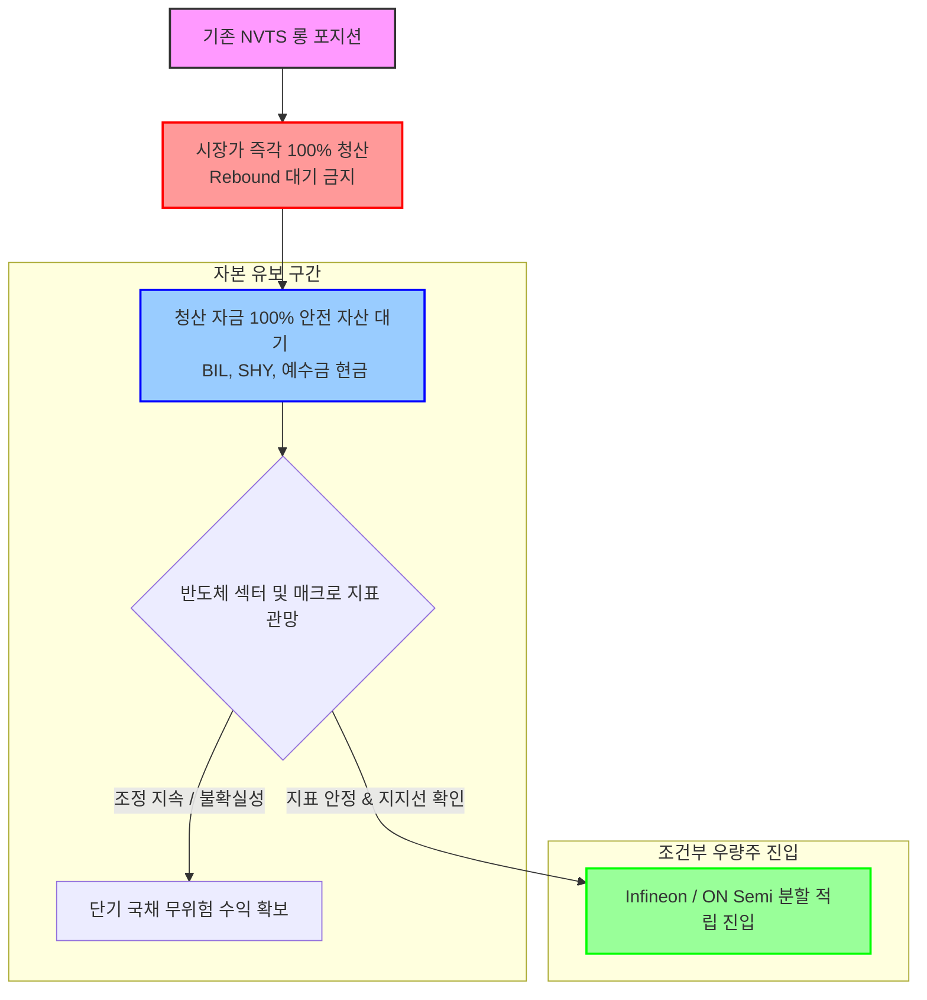

Conservative Analyst: 공격적 분석가(Bull)의 무모한 매수(BUY) 의견과 중립적 분석가(Neutral)의 절반에 걸친 관망(HOLD) 주장을 면밀히 분석했습니다. 리스크 관리 부서의 판단에 따르면, 두 분석가는 현재 자본 시장의 위험 요소와 재무 분석의 기본적 원칙을 심각하게 간과하고 있습니다. 특히 데이터 왜곡과 지나친 성장 편향으로 인해 당사의 자산이 파괴적인 변동성에 노출될 위기에 처해 있습니다.

이에 리스크 관리 부서는 정량적 재무 지표와 시장 환경에 기반하여 두 분석가의 주장을 강력히 비박하며, 기존 전량 매도(SELL) 결정을 지지하는 동시에 더 안전한 리스크 관리 방식으로의 **실행 계획 조정(Adjustment)**을 제안합니다.

📂 **최종 리스크 보고서 아티팩트:** [nvts_conservative_risk_response.md](file:///C:/Users/kmho1/.gemini/antigravity-cli/brain/13edd3ee-9c6a-47e0-91cc-477a4ca43802/nvts_conservative_risk_response.md)

---

### ⚖️ 두 관점의 치명적 맹점 지적 및 반론

#### 1. 공격적 분석가(BUY)의 성장 편향 및 정량적 왜곡 반박

* **엔비디아 MGX 등재와 실제 수주의 괴리 및 독점 프레임 반박**: 
  공격적 분석가는 Blackwell GPU의 20kW/10kW 전력 밀도를 충족할 수 있는 화합물 반도체 전력 보드가 나비타스의 GaNFast 제품군이 유일하며 대형 PSU 제조사들이 필수 채택해야 한다고 주장합니다. 이는 완전히 왜곡된 사실입니다. **Infineon (CoolGaN/CoolSiC)** 및 **ON Semiconductor (EliteSiC)** 등 글로벌 반도체 거인들은 이미 고전력 밀도 MGX 레퍼런스를 개발 완료했으며, 자체 팹(Fab)을 통해 안정적인 대량 공급 능력을 갖추고 있습니다. 1분기 매출이 860만 달러에 불과하고 분기 영업손실이 -$27.32M에 이르는 영세 팹리스 NVTS가 기술을 독점하고 있다는 프레임은 허구이며, 대형 고객사들은 공급 위험이 적은 우량 강자들을 최우선 파트너로 삼을 것입니다.
* **Runway 모델링의 오류 (Accelerating Cash Burn)**: 
  공격적 분석가는 $221M의 현금성 자산이 있어 분기 적자(-$16.75M) 기준 3.2년간 안전하다고 주장하나, 이는 R&D 가속화와 양산 비용 증대에 따른 현금 소진 속도의 가속화를 무시한 정적 계산 오류입니다. 실제로 NVTS의 분기 FCF 적자는 **지난 분기 -$8.16M에서 이번 분기 -$16.75M로 단 1개 분기 만에 2배로 폭증**했습니다. 이 같은 동적 캐시 번 속도라면 실제 추가 희석 없는 런웨이는 **1.5년 ~ 2년 미만**에 불과하며, 추가 유상증자는 불가피할 것입니다.
* **내부자 엑시트 시그널 왜곡 비판**: 
  핵심 인사인 Ranbir Singh 이사의 $108.7M(372만 주) 매각을 단순 포트폴리오 다각화로 축소하는 것은 위험 감수 편향입니다. Singh 이사를 포함한 이사회 멤버들은 5월 27~28일 단 이틀간 **총 1.16억 달러**의 지분을 처분했습니다. 핵심 내부자들이 최고점(YTD +340%, P/S 177.5배)에서 이토록 공격적으로 지분을 매각한 것은 현재의 밸류에이션이 정당화될 수 없는 거품임을 스스로 인지하고 있음을 보여주는 가장 강력한 경고입니다.
* **$24.50 손절선 설정의 기술적 한계**: 
  상대방은 $24.50 손절선으로 하방을 고정한다고 주장합니다. 하지만 변동성 지표 ATR이 **$3.19**에 달하고 베타가 **3.762**인 극단적 고변동성 종목에서 현재가 대비 19% 하단인 $24.50 손절선은 지수 조정이나 단기 매물 소화 등의 일상적인 흔들림(Whipsaw)에 걸려 **손실만을 확정 지을 확률이 비정상적으로 높습니다**.

#### 2. 중립적 분석가(HOLD)의 타협안에 대한 위험성 비판

* **잉여현금흐름(FCF) 데이터 왜곡 바로잡기 (중요)**:
  중립적 분석가 보고서에서는 NVTS의 TTM 잉여현금흐름(FCF)이 $43.77M로 양수라고 기록하고 있으나, 이는 **완벽한 데이터 오류**입니다. 실제 NVTS의 분기별 FCF는 지난 4개 분기 연속 적자(**1Q26: -$16.75M, 4Q25: -$8.16M, 3Q25: -$10.73M, 2Q25: -$11.91M**)를 기록 중이며, TTM 기준 FCF는 **-$47.55M**의 순유출 상태입니다. 치명적인 데이터 왜곡을 기반으로 수립된 중립적 리스크 관리안은 신뢰할 수 없습니다.
* **HOLD 및 60~70% 잔여 비중 보유의 치명적 노출**: 
  YTD 340% 이상 폭등하여 P/S 177.5배에 도달한 투기성 적자 기업의 주식을 60~70%나 계속 보유하는 것은 리스크 통제 포기입니다. 주가 폭락 시 60% 이상의 자본이 고스란히 영구적 자본 손실(80% 이상의 자산 폭락 가능성)에 노출됩니다.
* **최종 손절선 $22.00 하향의 무책임성**: 
  중립적 분석가는 손절선을 $22.00로 내리자고 주장하지만, 이는 현재가($30.46) 대비 **무려 28%의 하방 위험을 열어두어 영구적 손실폭을 확대하는 안일한 판단**입니다. 보수적 자본 보존 관점에서 28%의 원금 손실을 감수하는 리스크 전략은 절대 수용 불가능합니다.
* **우량 자산(Infineon / ON Semi)의 펀더멘털 가치 과소평가**:
  중립적 분석가는 대안으로 제시된 인피니온과 온세미컨덕터가 오토모티브 및 레거시 수요 둔화의 매크로 리스크를 안고 있다고 지적합니다. 그러나 이들 기업은 P/S 2.1배(인피니온), P/S 3.4배(온세미)로 극도로 저평가되어 있으며, 수십억 달러의 영업이익과 강력한 FCF를 안정적으로 창출하는 시장 지배자들입니다. 경기 사이클 하강을 버틸 재무 체력이 충분한 우량주와, 생존 자체가 불투명한 적자 투기주를 평면 비교하는 것은 명백한 논리적 모순입니다.

---

### 🛡️ 트레이더를 위한 전략적 실행 계획 조정 (Low-Risk Adjustments)

리스크 관리 부서는 기존의 전량 매도 실행 계획이 노출하고 있는 단기 변동성 및 시장 리스크를 최소화하기 위해 다음과 같이 실행 지침을 조정할 것을 권고합니다.

1. **단기 반등 대기 배제, 시장가 즉각 전량 청산 (Immediate Exit)**:
   * **기존 계획**: "단기 반등 흐름이 연출될 때 전량 청산"
   * **조정 계획**: 현재가($30.46 부근) 혹은 시장 개장 즉시 **즉각 시장가 전량 청산**.
   * **조정 사유**: 베타 3.762, ATR 3.19달러에 달하는 초고변동성 종목에서 반등을 기다리는 것은 타이밍 리스크를 가중시킵니다. 내부자 대량 매도 매물이 출회되고 시장 심리가 경계로 돌아선 현시점에서는 찰나의 순간에 폭락갭이 발생할 수 있으므로, 즉각적인 전량 탈출이 자본 보존에 가장 안전합니다.

2. **확보한 자본의 100% 현금/단기 국채 ETF(BIL, SHY) 일시 유보 (Capital Parking)**:
   * **기존 계획**: "확보한 자본은 Infineon 또는 ON Semiconductor 등 우량 기업으로 즉시 재배분"
   * **조정 계획**: 청산 자금은 즉시 주식으로 재배분하지 않고, **단기 국채 ETF(BIL, SHY) 또는 예수금 현금 상태로 100% 유보**.
   * **조정 사유**: 현재 브로드컴 발 반도체 섹터 조정 압력이 존재하며, 인피니온과 온세미 또한 레거시 자동차/산업용 반도체 수요 둔화라는 매크로 불확실성에 노출되어 있습니다. 위험 자산에서 탈출한 후 또 다른 주식 자산으로 즉각 이동하는 것은 체계적 시장 리스크(Systemic Risk)를 피하지 못합니다. 단기 국채로 자본을 파킹하여 무위험 수익을 취하며 시장 안정을 대기하는 것이 보수적 운용에 부합합니다.

3. **우량 자산 재진입 조건화 (Conditional Reentry)**:
   * 매크로 불확실성이 완화되고, Infineon 및 ON Semiconductor의 주가가 견고한 기술적 지지선에 도달하여 하방 경직성이 증명되는 시점에 한하여 확보된 현금의 분할 적립 진입을 승인합니다.

리스크 관리 부서는 당사의 안정성을 확보하고 영구적 자본 손실을 방지하기 위해 이 조정된 실행 계획을 지체 없이 수행할 것을 강력히 촉구합니다.